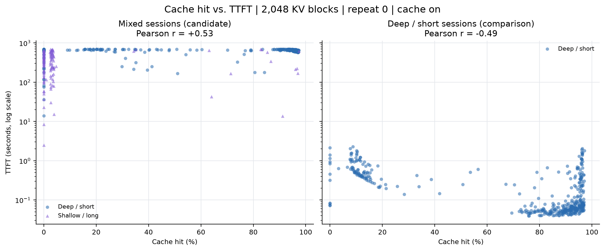
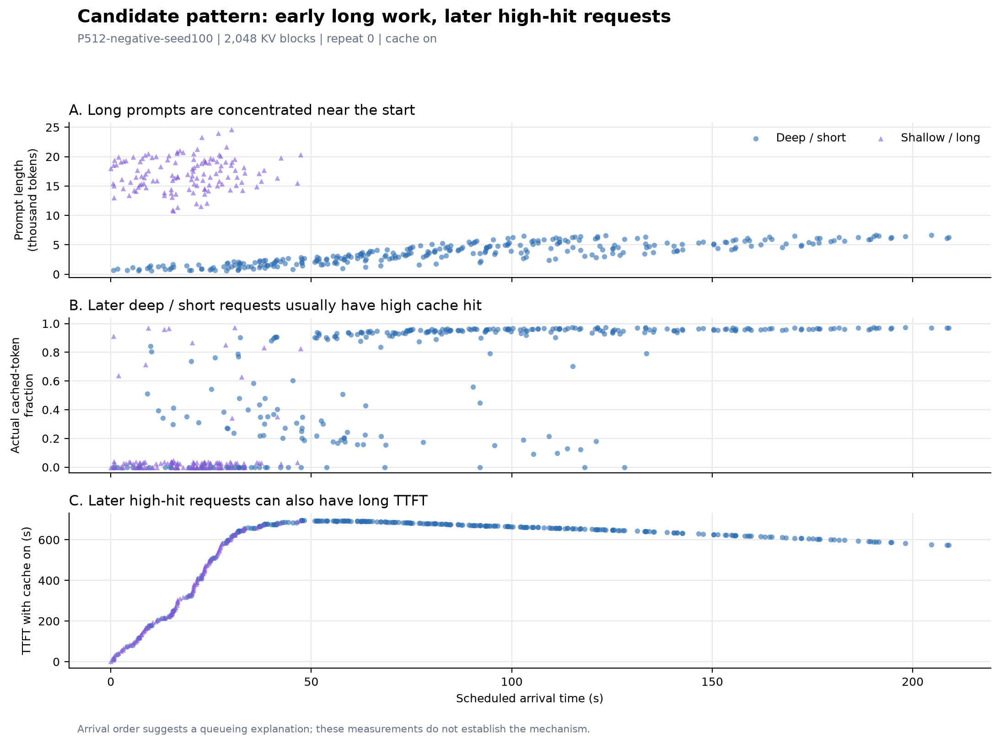

# Week 4 Update: Cache Hit and TTFT

## What we did

We looked for trace patterns where higher cache hit comes with longer TTFT. We completed the 16-run pilot on one A30 with Qwen3-4B, comparing a mix of long and short prompts with a workload of short-input, many-turn sessions.

## What we found

 Long prompts arrived early. Later requests often reused more cached context but still waited long for their first token.

Each point is a request; the mixed workload shows the positive relationship we were looking for.

Selected requests from one run (cache on, 2048 KV blocks, first repetition):

| Arrival (approx.) | Input tokens | Cache hit | TTFT |
| --- | ---: | ---: | ---: |
| 0 s | 17,996 | 0% | 2.5 s |
| 10 s | 1,443 | 84% | 177.6 s |
| 60 s | 2,919 | 92% | 692.2 s |

Cache hit means the fraction of input tokens reused. The example runs also showed a positive hit–TTFT correlation (Pearson +0.53).

## Possible reason

Most of the delay happened before requests were first scheduled. Averages for the same mixed-workload run, after subtracting warmup:

| Measurement | Mean time |
| --- | ---: |
| Waiting before first scheduling | 540.5 s |
| First scheduling to first token | 0.88 s |
| Total server TTFT | 541.5 s |

Read top to bottom: prompt length, cache hit, and TTFT, all against arrival time.

Early long requests may have built a backlog. Later requests could save computation through caching but still spend a long time waiting. We have not yet confirmed which constraint (scheduling/KV-memory) caused the long wait.

## Next steps

- Does the pattern persist if we interleave the requests differently?
- Should the next experiment record why each request waits before its first scheduling event?

Details: [full results](analysis.json), [all-run plots](figures/cache-hit-ttft.png), [run settings](plan.json), and server metrics [before](run-009-on/metrics-before.txt) / [after](run-009-on/metrics-after.txt).
